<h1 align="center">Hi, I'm Argh Jain 👋</h1>
<h3 align="center">Full-Stack Developer, moving deeper into Cloud & DevOps</h3>

  
  
  
  

---

### About Me

- 🎓 B.Tech in Internet of Things @ Madhav Institute of Technology and Science — graduating **May 2027**
- 💼 Full Stack Intern @ **Aleut Technologies** — building and running a production platform used company-wide
- 🔭 Currently building **CodeCollab**, a real-time collaborative code workspace with a multi-provider AI pair-programmer
- 🌱 Currently learning **AWS, Terraform, and DevOps** in depth
- 💬 Ask me about full-stack development, cloud infrastructure, or agentic AI integrations
- ⚡ I don't stop at "it works" — I own the infrastructure my code runs on too

---

### Featured Projects

**[CodeCollab — Real-Time Collaborative Code Workspace](https://github.com/arghjain29/chat_app_with_AI_codeAssistant)**
Real-time collaborative editor built on Yjs CRDTs and self-hosted Hocuspocus over WebSockets, with a multi-provider AI pair-programmer (Gemini, Claude) featuring streaming responses and ordered fallback, Clerk auth, in-browser code execution via WebContainers, and Razorpay billing with HMAC-verified, idempotent webhooks.
`TypeScript` `React` `Node.js` `MongoDB` `Yjs` `WebContainers`
🔗 [Live](https://code-collab-lovat.vercel.app) · [Repo](https://github.com/arghjain29/chat_app_with_AI_codeAssistant)

**[Real-Time Machine Anomaly Detection System](https://github.com/arghjain29)**
End-to-end IoT telemetry pipeline — sensors stream to Azure IoT Hub, which feeds a self-hosted ML inference API classifying readings as normal or anomalous in real time, with results surfaced on a live React monitoring dashboard.
`Azure IoT Hub` `Azure ML` `Node.js` `MongoDB` `React` `WebSockets`

**[Scaffx — CLI Tool](https://github.com/arghjain29/Scaffx)**
Published npm CLI that scaffolds full-stack projects across 7+ React/Node/Express templates, with a modular `scaffx add` command for patching features into existing projects.
`TypeScript` `Node.js` `npm`
🔗 [npm](https://www.npmjs.com/package/scaffx) · [Repo](https://github.com/arghjain29/Scaffx)

---

### Tech Stack

**Languages**

**Frontend**

**Backend & Realtime**

**Databases**

**Cloud, AI & DevOps**

---

### GitHub Stats

  
  

  
  

---

<i>Building things I want to exist, then keeping them running.</i>

